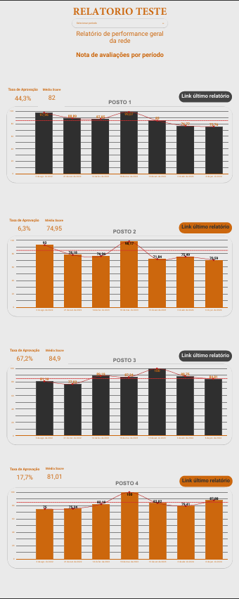
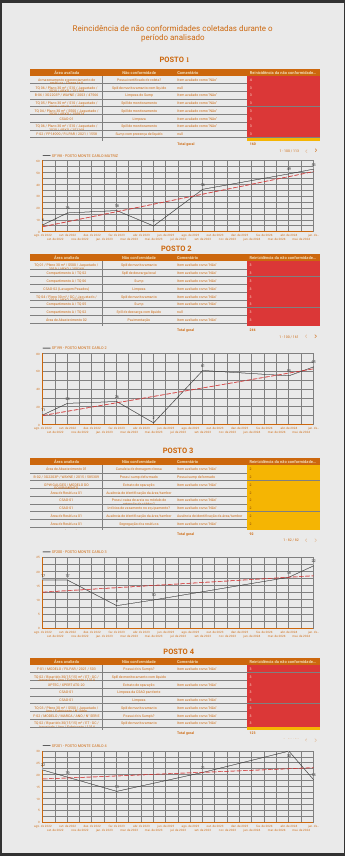

# ETL Para extrair dados de api da aplicação [ChecklistFácil](https://www.checklistfacil.com/)

* [Introdução](#introdução)
* [Instalação de Dependências](#instalação-de-dependências)
* [Estrutura do Código](#estrutura-do-código)
* [Variáveis](#variáveis)
* [Configuração do ambiente](#configuração-do-ambiente)
* [Execução da Aplicação](#execução-da-aplicação)

# Introdução

ETL feita para extrair dados relevantes para analytics focado em performance e reincidências de não confirmidades.

# Instalação de Dependências

> pip install -r requirements.txt

# Estrutura do Código

O código está organizado da seguinte forma:

- `main.py`: Contém a lógica principal da aplicação, funcionando como startpoint e também orchestrando as demais funções.
- `fetch_evaluation_data`: Realiza a extração dos dados relevantes da API.
- `fetch_evaluations`: Extrai todos os ID de avaliação durante o período selecionado.
- `process_data`: Filtra apenas os evaluationID cujo status é 6, 5 que seriam os Aprovados/Concluidos.
- `carregar_nao_conformidades_incidencias`: Carrega o banco de dados com as não conformidades padrão avaliadas.
- `extrair_nao_conformidades`: Recebe os dados e percorre toda a resposta verificando as não conformidades e adicionando em uma lista separada, fazendo tratamento de exceções e validando as respostas.
- `verify_history`: Verifica o histórico de comentários da avaliação.
- `data_to_jsonl`: Realiza o "Salvamento" dos dados em JSONL no padrão determinado abaixo.
- `save_to_bucket_jsonl`: Realiza o salvamento do seu arquivo no caminho do bucket determinado.

## Variáveis

As variáveis principais utilizadas na aplicação incluem apenas a chave de API para utilização.
Para utilizar a aplicação localmente e integrar com a GCP, deverá antes, instalar o [Google Cloud SLI](https://cloud.google.com/sdk/docs/install?hl=pt-br)

## Configuração do ambiente

Primeiro, criei um tópico utilizando o serviço de mensageria [Pub/Sub](https://cloud.google.com/pubsub/docs/overview?hl=pt-br), defini um agendamento no [Cloud Scheduler](https://cloud.google.com/scheduler?hl=pt-br), desenvolvi o código necessário dentro de uma [Cloud Function](https://cloud.google.com/functions?hl=pt_br) e configurei um bucket no [Cloud Storage](https://cloud.google.com/storage?hl=pt-BR).

# Execução da Aplicação

>Para teste local | python main.py(None, None)

O funcionamento da pipeline é o seguinte: quando o horário agendado no [Cloud Scheduler](https://cloud.google.com/scheduler?hl=pt-br) for atingido, ele acionará o tópico do [Pub/Sub](https://cloud.google.com/pubsub/docs/overview?hl=pt-br) vinculado. A [Cloud Function](https://cloud.google.com/functions?hl=pt_br), que está configurada para ser disparada pelo tópico do Pub/Sub, será executada. A função, então, processará os dados e os armazenará no bucket configurado.

# Etapas seguintes

Após toda extração tratamento e salvamento dos dados no bucket, podemos realizar o carregamento dos dados no BigQuery e Criar um relatório customizado no Looker Studio para acompanhar as priacipais métricas.

